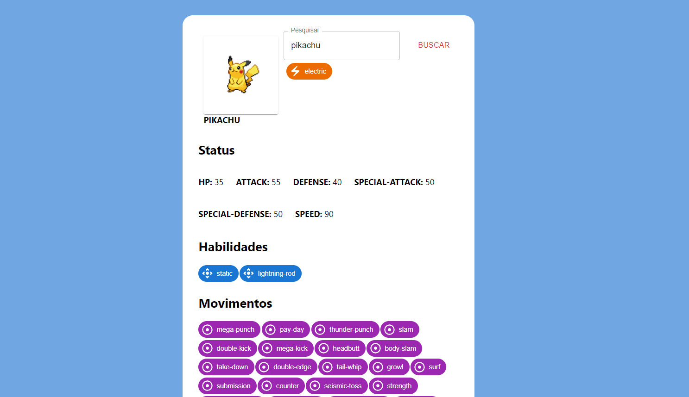

# Pokedex

Projeto feito para consumir a api https://pokeapi.co/

## Iniciando

### Clonando o projeto
Para clonar o projeto use o comando:

`git clone git@github.com:Rian6/consumindo-api-pokemon.git`

### Instalando dependências
Para instalar dependências rode o comando 

`npm install`

Na raiz do projeto, lembrando que é necessário instalar o node na sua maquina, você pode instalar aqui: https://nodejs.org/en

### Rodando o projeto

Para rodar em modo desenvolvimento execute o comando: 

`npm start`

Abra [http://localhost:3000](http://localhost:3000) e veja aplicação no seu navegador.

